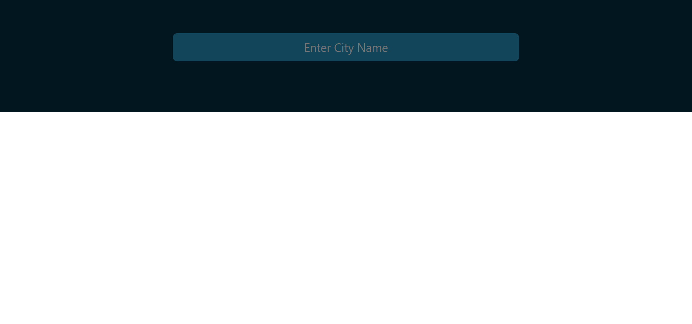
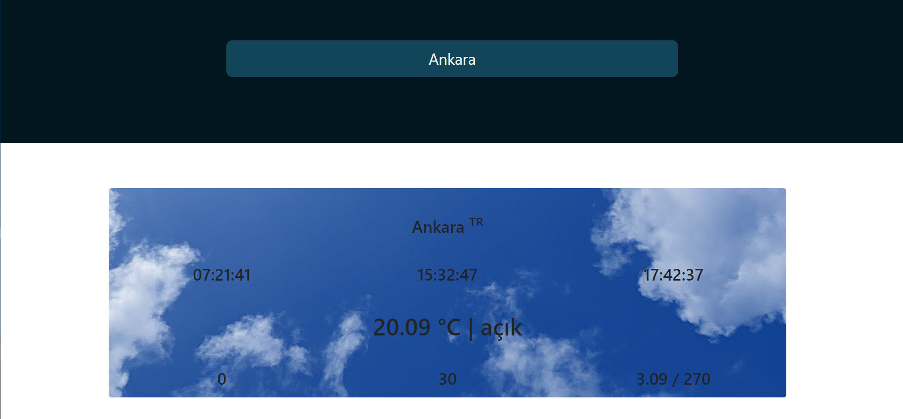
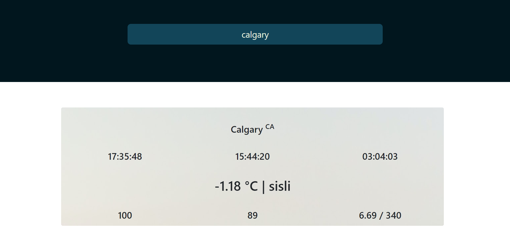

# Giriş
Daha önce Javascript ile yapmış olduğum Hava durumu uygulamasını Angular üzerinde gerçekleştirilmektedir.
Kodu çalıştırmak için gerekli direktifler aşağıda bulunmaktadır.
Yazılanlara ek olarak proje dosyalarında node_mudules klasörü olmaması durumunda `npm i` ile eksik paketleri yükleyebilirsiniz 

## Temel Bileşenler
* Angular 
* Bootstrap
* https://openweathermap.org

önceki projede olduğu gibi bu proje içinde bir API Key gerekmektedir.
## Temel Amaç
Angular üzerindeki temel yapıları hedef alan bir çalışmadır.
Component
Service
Pipe
Data binding
style & class binding
parent -> <- child  arasında veri transferi gibi temel konuların örneklendiği bir çalışmadır.

## Görseller

---
# WeatherApp

This project was generated with [Angular CLI](https://github.com/angular/angular-cli) version 14.2.6.

## Development server

Run `ng serve` for a dev server. Navigate to `http://localhost:4200/`. The application will automatically reload if you change any of the source files.

## Code scaffolding

Run `ng generate component component-name` to generate a new component. You can also use `ng generate directive|pipe|service|class|guard|interface|enum|module`.

## Build

Run `ng build` to build the project. The build artifacts will be stored in the `dist/` directory.

## Running unit tests

Run `ng test` to execute the unit tests via [Karma](https://karma-runner.github.io).

## Running end-to-end tests

Run `ng e2e` to execute the end-to-end tests via a platform of your choice. To use this command, you need to first add a package that implements end-to-end testing capabilities.

## Further help

To get more help on the Angular CLI use `ng help` or go check out the [Angular CLI Overview and Command Reference](https://angular.io/cli) page.
